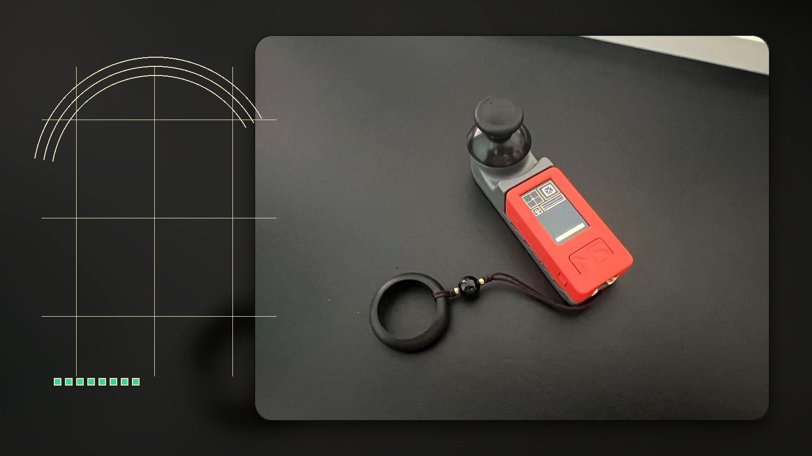
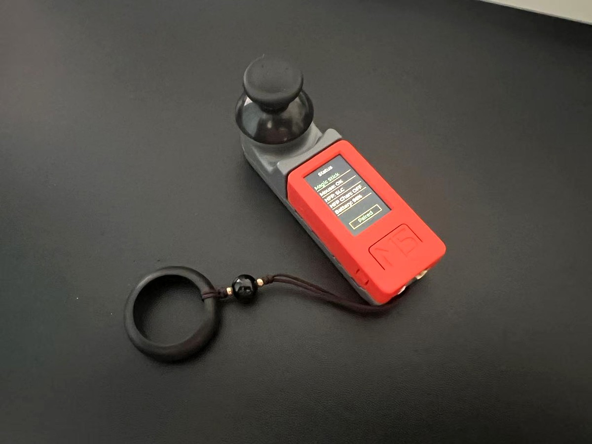
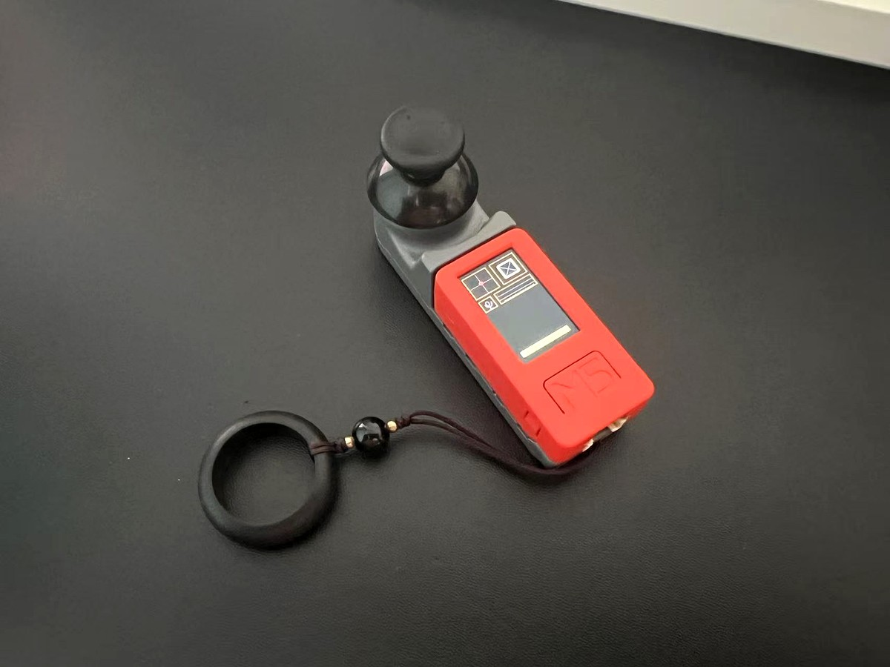
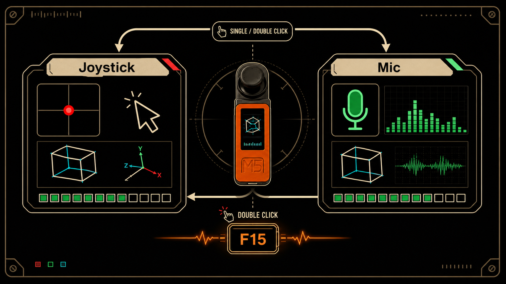
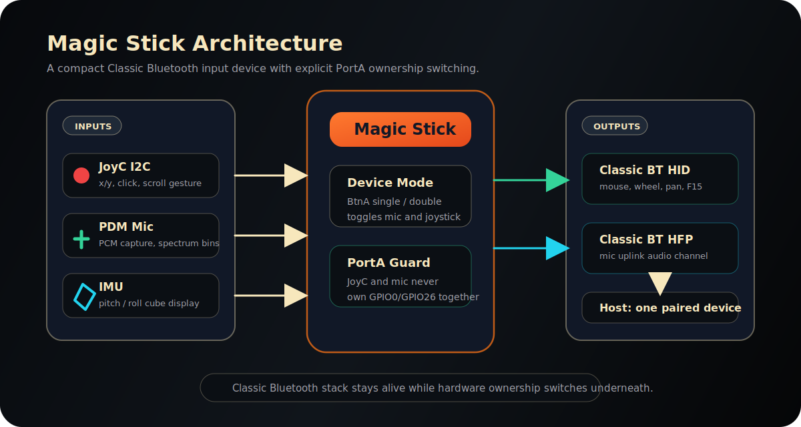
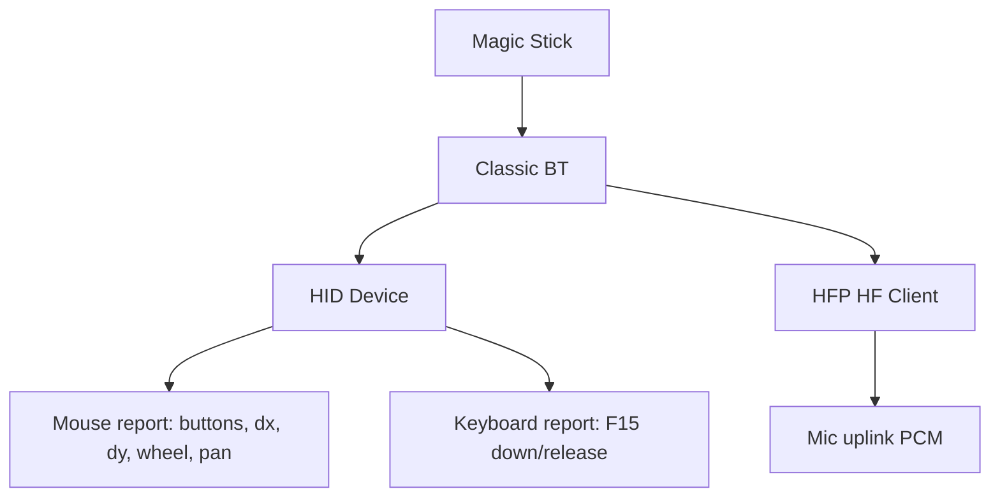

# Magic Stick

<p align="center">
  <strong>A palm-sized Bluetooth mouse, microphone, motion display, and shortcut trigger built on M5StickC-Plus.</strong>
</p>

<p align="center">
  
  
  
  
</p>

<p align="center">
  
</p>

---

`Magic Stick` is firmware for an **M5StickC-Plus + JoyC HAT** that turns a tiny handheld device into a Bluetooth input companion:

- JoyC controls the computer mouse.
- JoyC click sends left click.
- JoyC double-press-and-hold enters scroll mode.
- Internal PDM mic becomes a Classic Bluetooth HFP microphone.
- IMU drives a live 3D cube on the screen.
- BtnA double-click toggles function mode and sends one macOS `F15` tap.

The product exposes a single Classic Bluetooth device name:

```text
Magic Stick
```

## Product Snapshot

| Area | What It Does |
| --- | --- |
| Input | Bluetooth HID mouse movement, left click, vertical wheel, horizontal pan |
| Audio | Bluetooth HFP microphone using the StickC internal PDM mic |
| Motion | IMU-based 3D cube rendered on the 135x240 screen |
| UI | Two-page Retro Scope interface: `Status` and `Magic` |
| Shortcut | BtnA double-click sends macOS `F15` after mode switching |
| Hardware safety | JoyC and mic are never active on PortA at the same time |

## Gallery

<p align="center">
  
  
</p>

## Hardware

| Part | Role |
| --- | --- |
| M5StickC-Plus | ESP32-PICO-D4, LCD, IMU, buttons, battery, PDM mic |
| M5Stack JoyC HAT | I2C joystick and click input, address `0x54` |
| PortA GPIO0/GPIO26 | Shared bus/pin resource switched between JoyC and mic usage |

## Interaction Model

`Magic Stick` keeps the UI deliberately small: one maintenance page and one work page.

| Page | Purpose |
| --- | --- |
| `Status` | Bluetooth state, HFP audio channel, battery, pairing state |
| `Magic` | Joystick, IMU cube, mic icon, mic spectrum, battery cells |

### Buttons

| Action | Page | Result |
| --- | --- | --- |
| BtnB short press | `Status` | Enter `Magic` |
| BtnB short press | `Magic` | Return to `Status` |
| BtnA single click | `Magic` | Wait `450ms`, then toggle Mic/Joystick |
| BtnA double click | `Magic` | Toggle Mic/Joystick, then send one `F15` HID tap |
| BtnB hold 3s | Any | Re-enter discoverable/pairing state |
| BtnB hold 8s | Any | Clear Bluetooth bonds and restart |

### Magic Function States

<p align="center">
  
</p>

When joystick is on:

- JoyC X/Y controls mouse movement.
- JoyC press sends left click.
- One click followed by a second hold within `450ms` enters scroll mode.
- Scroll mode sends wheel/pan instead of mouse movement.

When mic is on:

- JoyC I2C is shut down and PortA is released.
- Internal PDM mic starts.
- HFP audio path sends real PCM to the host.
- HID remains connected, but mouse movement is not sent.

## Bluetooth Stack

<p align="center">
  
</p>



The firmware uses one Classic Bluetooth identity and one product name. After a HID descriptor change, macOS may cache the old descriptor; remove and re-pair `Magic Stick` if keyboard shortcut reports do not appear.

## UI: Retro Scope

The UI uses a black background, warm white linework, compact geometry, and color only where it communicates state.

| Element | Behavior |
| --- | --- |
| Joystick dot | Red when joystick is active, gray when disabled, yellow in scroll mode |
| Joystick press | Dot grows while pressed |
| Mic icon | Green when mic is active, gray when muted/off |
| Spectrum | Shows live mic energy bins |
| Battery | 12 compact cells; green above 60%, yellow from 20%-59%, black below 20% |

## Firmware Layout

```text
main/
  bluetooth/      Classic BT HID mouse, F15 key report, HFP mic control
  joystick/       JoyC I2C recovery, button decode, mouse/scroll controller
  mic/            PDM mic capture and spectrum data
  ui/             LVGL Status and Magic screens
  device_mode.*   PortA-safe peripheral switching
  button_action.* BtnA single/double-click state machine
```

## Build

```sh
. /Users/xurui/esp/esp-idf-v5.4.2/export.sh
idf.py build
```

## Flash

```sh
idf.py -p /dev/cu.usbserial-49523D2FE2 -b 115200 flash
```

If the device remains in download mode after flashing, unplug USB once and power-cycle it.

## Host Tests

```sh
cc -I main -I main/joystick test/test_button_action.c main/button_action.c -o /tmp/test_button_action
/tmp/test_button_action

cc -I main/joystick test/test_mouse_controller.c main/joystick/mouse_controller.c -lm -o /tmp/test_mouse_controller
/tmp/test_mouse_controller

cc -I main/mic test/test_mic_spectrum.c main/mic/mic_spectrum.c -lm -o /tmp/test_mic_spectrum
/tmp/test_mic_spectrum

cc -I main/bluetooth test/test_bt_pairing_status.c main/bluetooth/bt_pairing_status.c -o /tmp/test_bt_pairing_status
/tmp/test_bt_pairing_status
```

## Current Notes

- ESP-IDF target is `esp32`.
- M5Unified is pinned through the project dependency lock.
- `Magic Stick` currently targets macOS-style host workflows, with Windows compatibility expected for the mouse/HFP portions.
- F15 requires an active HID connection. On the Status page, confirm `Mouse: OK` before testing the shortcut.

## License

See [LICENSE](LICENSE).
