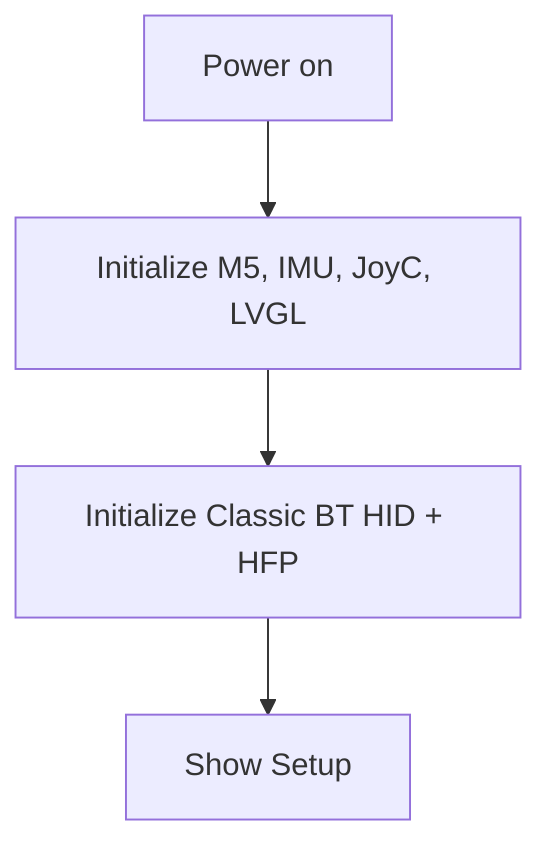
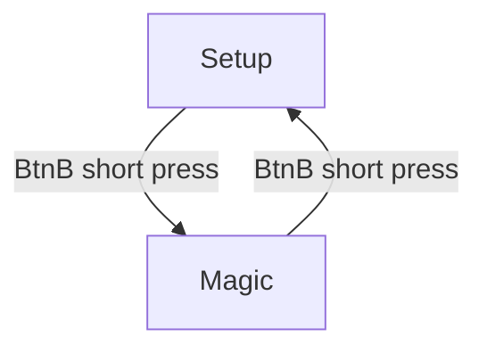
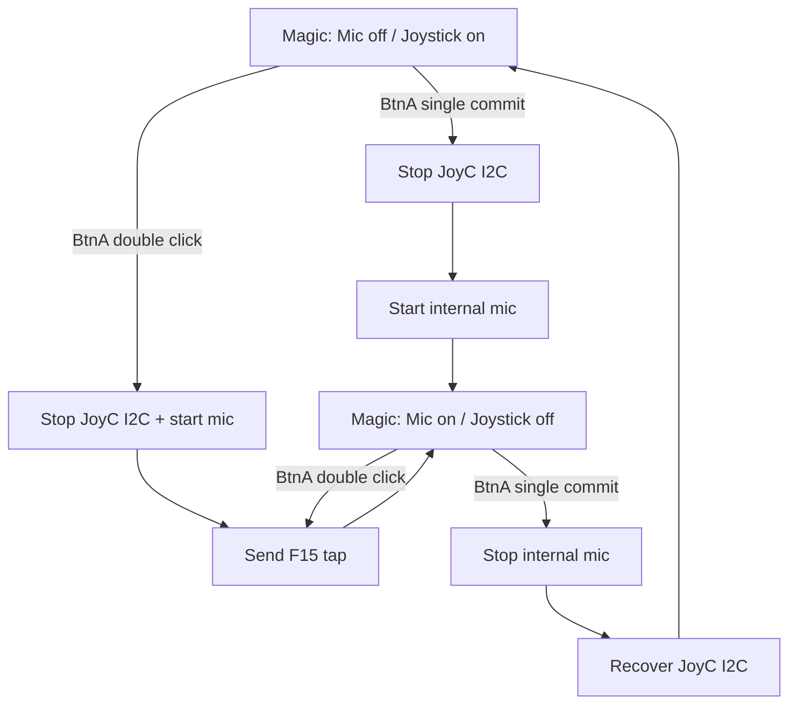
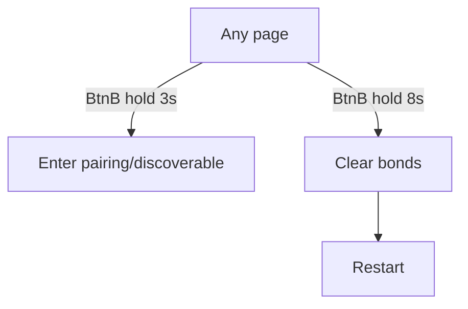

# Magic Stick UI and Interaction Review

本文档整理当前固件的 UI 页面、显示内容、按键交互和外设状态流，供产品交互 review 使用。

当前版本定位:

- 产品名: `Magic Stick`
- 蓝牙设备名: `Magic Stick`
- 硬件: M5StickC-Plus + JoyC 摇杆 + 内置 IMU + 内置 PDM mic
- 蓝牙能力: Classic BT HID Mouse + Classic BT HFP mic
- 屏幕尺寸: `135 x 240`
- UI 主题: 复古黑底、暖白线框、绿色/青色状态色
- 当前页面: `Setup` 和 `Magic`

## 1. 页面总览

当前固件只保留两个产品页面。

| 页面 | Mode | 入口 | 作用 |
| --- | --- | --- | --- |
| Setup | `MODE_SETUP` | 开机默认、Magic 页面按 BtnB | 查看蓝牙状态、电量和维护连接 |
| Magic | `MODE_RUNNING` | Setup 页面按 BtnB | 合并展示摇杆、IMU、音频，并承载鼠标/mic 功能 |

旧的独立 IMU 页面和独立 Mic 页面已废弃并从源码中删除。IMU 3D 展示和 mic 频谱仍保留在 Magic 页面内。

## 2. 全局交互

| 操作 | 当前页面 | 行为 |
| --- | --- | --- |
| BtnB 短按 | Setup | 进入 Magic |
| BtnB 短按 | Magic | 返回 Setup |
| BtnA 单击 | Magic | 延迟 `450ms` 确认非双击后，切换 `Mic on / Joystick off` 与 `Mic off / Joystick on` |
| BtnA 双击 | Magic | 打开 `Mic on / Joystick off`，并发送一次 macOS F15 短按 |
| BtnA 单击/双击 | Setup | 无功能 |
| JoyC 单击后第二次按住 | Magic / Joystick on | 进入滑动模式，松开后退出 |
| BtnB 长按 3s | 任意页面 | 重新进入可发现/配对状态 |
| BtnB 长按 8s | 任意页面 | 清除蓝牙 bonding 并重启 |

按键保护逻辑:

- BtnA 使用双击优先状态机，第一击后等待 `450ms`；若无第二击才提交单击切换。
- BtnA 双击只在 Magic 页面生效；Setup 页面不创建 pending action。
- BtnB 短按动作后等待 BtnA 和 BtnB 都松开。
- BtnB 松开后进入 `300ms` cooldown，避免连续误触发。
- BtnB 长按 3s 和 8s 使用独立 latch，避免同一次长按重复触发。

## 3. Setup 页面

### 3.1 页面用途

Setup 是设备维护和连接状态页。它不承载摇杆控制，也不展示 IMU 或音频图形。

### 3.2 当前显示内容

| y 坐标 | 显示 | 含义 |
| --- | --- | --- |
| 11 | `Status` | 页面标题 |
| 42 | `Magic Stick` | 蓝牙设备名 |
| 67 | `Mouse: <status>` | HID mouse profile 状态 |
| 91 | `HFP: <status>` | HFP service level connection 状态 |
| 115 | `HFP Chan: <ON/OFF>` | HFP audio channel 是否打开 |
| 139 | `Battery: <percent>%` | 电池电量 |
| 196 | `Discoverable` / `Pairing` / `Paired` | 配对状态 |

状态行使用下划线分隔，不再使用每行方框。底部只显示英文配对状态值，不带任何前缀，也不显示旧的跳转提示。

### 3.3 状态字段含义

| 字段 | 常见值 | 说明 |
| --- | --- | --- |
| `Mouse` | `OK` / `WAIT` / `INIT` | 电脑侧 HID mouse 是否已连接 |
| `HFP` | `SLC` / `WAIT` / `INIT` | 电脑侧 HFP 控制链路是否建立 |
| `HFP Chan` | `ON` / `OFF` | 电脑侧是否已打开 HFP audio channel |
| `Battery` | `0%` - `100%` | AXP192 电量读数 |
| 底部状态 | `Discoverable` / `Pairing` / `Paired` | 当前蓝牙配对状态 |

## 4. Magic 页面

### 4.1 页面用途

Magic 是唯一工作页面。它同时展示:

- JoyC 摇杆位置和点击状态
- IMU 3D 姿态 cube
- Mic 图标和频谱/电平
- 底部电量格

Magic 页面没有顶部标题，也不显示电量文字。电量改为底部电量格显示。

### 4.2 布局

| 区域 | 位置 | 内容 |
| --- | --- | --- |
| 左上面板 | x=7, y=9, 56x56 | 摇杆平面和红色摇杆点 |
| 右上面板 | x=72, y=9, 56x56 | IMU 3D cube |
| 中部左侧 | x=7, y=72, 28x28 | Mic 图标，关闭为灰色，开启为绿色 |
| 中部右侧 | x=43, y=72, 86x28 | Mic 频谱柱状图 |
| 底部电量格 | x=11, y=211, 113x12 | 12 个白色边框 cell，按电量分段填充 |

### 4.3 摇杆面板

- 红点表示当前 JoyC X/Y 位置，默认直径为 8px。
- 十字线表示摇杆中心参考。
- 摇杆处于中心死区时红点回到中心。
- 摇杆按下时红点放大为 16px 直径，状态行不显示 click 文案。
- 单击后 `450ms` 内第二次按住进入滑动模式，红点变为黄色并保持放大。
- 滑动模式中，上/下推发送纵向滚轮，左/右推发送横向滑动；此时不发送鼠标移动或左键按下。
- 松开第二次按住后退出滑动模式，红点恢复普通颜色。
- 当 joystick 功能关闭时，红点颜色变为深灰，表示当前不发送鼠标移动。

### 4.4 IMU 面板

- 3D cube 根据内置 IMU 加速度估算 pitch/roll 后实时旋转。
- 白色线表示 cube 边缘。
- 青色线表示正面交叉辅助线。
- IMU 姿态展示在 Magic 页面内持续更新，不依赖摇杆或 mic 当前是否开启。

### 4.5 音频面板

- 左侧 mic 图标显示 mic 功能状态: 关闭时灰色，开启时绿色。
- 右侧频谱柱显示内置 mic 当前采集到的能量分布。
- mic 功能关闭时，频谱会逐步回落或显示近似静音状态。
- mic 功能开启时，频谱根据采样数据实时变化，同时真实 PCM 进入 HFP 上行音频链路。

### 4.6 电量格

- 电量格位于屏幕下方但不贴底，采用 Option C: 12 cells, compact。
- 每个 cell 都有白色边框，整体尺寸为 `x=11, y=211, 113x12`。
- 电量 `>=60%` 时已填充 cell 使用绿色。
- 电量 `20%-59%` 时已填充 cell 使用黄色。
- 电量 `<20%` 时已填充 cell 使用黑色，因此在黑底上看起来接近空格，只保留白色边框。

## 5. Magic 内部功能状态

Magic 页面内有两种互斥功能状态。BtnA 单击在确认非双击后切换这两种状态；BtnA 双击会直接进入 mic 工作状态，并向 macOS 发送一次 F15 短按。

### 5.1 Mic off / Joystick on

这是进入 Magic 时的默认工作状态。

硬件状态:

- JoyC I2C 打开。
- 内置 mic 硬件采集关闭。
- HID mouse 保持连接并发送鼠标 report。
- HFP 控制链路保留。
- HFP audio channel 可以保持打开，但发送静音或不采集真实 mic。

用户体验:

- 摇杆控制电脑鼠标移动。
- 摇杆点击等于鼠标左键点击。
- 摇杆单击后第二次按住可进入滑动模式，用摇杆方向控制纵向/横向滚动。
- 屏幕仍显示 IMU cube。
- 音频区域显示静音或低电平。

### 5.2 Mic on / Joystick off

BtnA 单击从 joystick 工作状态切换到 mic 工作状态；BtnA 双击也会进入该状态，并额外发送一次 macOS F15 短按。如果已经处于 mic 工作状态，BtnA 双击只发送 F15，不会切回 joystick。

硬件状态:

- JoyC I2C 关闭并释放 PortA 共享引脚。
- 内置 PDM mic 打开。
- HID mouse profile 保持连接，但不发送鼠标移动。
- HFP 控制链路保留。
- HFP audio channel 保持或请求打开，并发送真实 PCM。

用户体验:

- 电脑侧仍看到同一个蓝牙设备。
- 系统 mic 输入来自 Magic Stick。
- 屏幕频谱随声音变化。
- 摇杆面板仍展示 UI，但不会控制鼠标。

## 6. 页面流程

### 6.1 开机

### 6.2 Setup 与 Magic 切换

### 6.3 Magic 功能切换

### 6.4 维护操作

## 7. 蓝牙行为

蓝牙栈保持 Classic BT 同一设备名和同一地址，用户侧目标是只配对一次。

| 功能 | 行为 |
| --- | --- |
| HID mouse | 在 Magic 的 joystick 状态下发送鼠标移动、点击、纵向滚轮和横向滑动 |
| HFP control | 保持 HFP 控制链路，电脑侧可识别 mic 能力 |
| HFP audio | 尽量保持 audio channel，mic 关闭时发送静音，mic 开启时发送真实 PCM |
| 配对 | BtnB 长按 3s 重新进入可发现状态 |
| 清除绑定 | BtnB 长按 8s 清除 bonding 并重启 |

## 8. Review Checklist

### Setup

- `Status` 标题是否清楚表达这是维护页。
- `Magic Stick` 是否和电脑蓝牙设备名一致。
- 底部是否只显示 `Discoverable`、`Pairing` 或 `Paired`。
- 底部没有旧跳转提示。
- 状态行下划线是否比旧方框更清爽。
- 蓝牙状态、电量在 135x240 屏幕内不裁切。

### Magic

- 顶部无标题后，页面是否更像工作台而不是菜单页。
- 底部电量格是否易读，绿色/黄色/黑色三档是否符合预期。
- 摇杆点是否易读，joystick 关闭时的灰色状态是否明显。
- 滑动模式黄色红点是否能明显区别普通鼠标模式。
- IMU cube 是否大小合适、不会被状态行挤压。
- mic 图标关闭灰色、开启绿色是否足够明确。
- 频谱区域是否能看出 mic 是否有输入。

### 交互

- BtnB 是否足够符合“Setup 入口”的心智模型。
- BtnA 单击延迟 `450ms` 后切换功能是否自然。
- BtnA 双击打开 mic 并发送 F15 是否容易触发且不会误伤单击。
- 从 mic 状态返回 joystick 状态后，摇杆是否稳定恢复。
- 从 joystick 状态进入 mic 状态后，电脑 mic 输入是否不中断。
- 单击后第二次按住进入滑动模式是否容易触发但不误伤普通点击。

## 9. 当前结论

当前 UI 已简化为两个页面:

- `Setup`: 设备/连接维护页。
- `Magic`: 摇杆、IMU、音频合并工作页。

这版交互的重点是减少页面数量，把传感器展示和真实输入能力集中到 Magic 页面，同时用 BtnB 固定承担 Setup 入口，降低切换路径复杂度。
